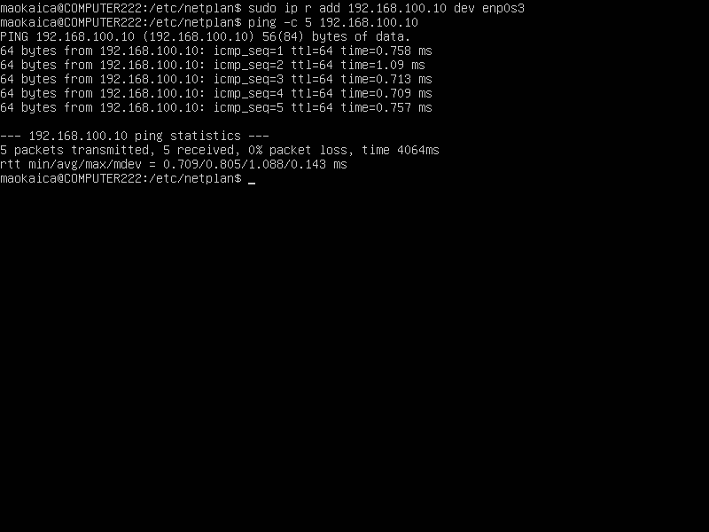

## Part 1. Инструмент ipcalc ##

#### 1.1. Сети и маски

1) Адрес сети 192.167.38.54/13<br>

- 
- ```192.160.0.0```<br>

2) Перевод маски 255.255.255.0 в префиксную и двоичную запись, /15 в обычную и двоичную, 11111111.11111111.11111111.11110000 в обычную и префиксную

- 
- ```255.255.255.0```<br>
- ```Префиксная: 28```<br>
- ```Двоичная: 11111111.11111111.11111111.00000000```<br>

- 
- ```/15```<br>
- ```Обычная: 255.254.0.0```<br>
- ```Двоичная: 11111111.11111110.00000000.00000000```<br>

- 
- ```11111111.11111111.11111111.11110000```<br>
- ```Обычная: 255.255.255.240```<br>
- ```Префиксная: 28```<br>

3) Минимальный и максимальный хост в сети 12.167.38.4 при масках: /8, 11111111.11111111.00000000.00000000, 255.255.254.0 и /4

- 

#### 1.2. localhost

- 

- 194.34.23.100 - нет
- 127.0.0.2 - да
- 127.1.0.1 - да
- 128.0.0.1 - нет

#### 1.2. Диапазоны и сегменты сетей

1) Какие из перечисленных IP можно использовать в качестве публичного, а какие только в качестве частных:
 
- 
- 10.0.0.45 - частный
- 134.43.0.2 - публичный
- 192.168.4.2 - частный
- 172.20.250.4 - частный
- 172.0.2.1 - публичный
- 192.172.0.1 - публичный
- 172.68.0.2 - публичный
- 172.16.255.255 - частный
- 10.10.10.10 - частный
- 192.169.168.1 - публичный

2) Какие из перечисленных IP адресов шлюза возможны у сети 10.10.0.0/18:

- 

- ```Возможные шлюза```<br>
- 10.10.0.2
- 10.10.10.10
- 10.10.1.255

## Part 2. Статическая маршрутизация между двумя машинами ##


- С помощью команды ip a посмотрел существующие сетевые интерфейсы.

- ```ws1```<br>
- 

- ```ws2```<br>
- 

- Описал сетевой интерфейс, соответствующий внутренней сети, на обеих машинах и задал следующие адреса и маски: ws1 - 192.168.100.10, маска /16, ws2 - 172.24.116.8, маска /12.

- ```ws1```<br>
- 
- 

- ```ws2```<br>
- 
- 

#### 2.1. Добавление статического маршрута вручную

- ```ws1```<br>
- 

- ```ws2```<br>
- 

#### 2.2. Добавление статического маршрута с сохранением

- ```ws1```<br>
- 
- 

- ```ws2```<br>
- 
- 

   
## Part 3. Утилита iperf3 ##

#### 3.1. Скорость соединения
- 8 Mbps = 1 MB/s
- 100 MB/s = 800000 Kbps
- 1Gbps = 1000 Mbps

#### 3.2. Добавление статического маршрута с сохранением

- ```ws1```<br>
- 

- ```ws2```<br>
- 


## Part 4. Сетевой экран ##

#### 4.1. Утилита iptables

Создал файл /etc/firewall.sh, имитирующий фаерволл, на ws1 и ws2

1) На ws1 применил стратегию, когда в начале пишется запрещающее правило, а в конце пишется разрешающее правило (это касается пунктов 4 и 5).
2) На ws2 применил стратегию, когда в начале пишется разрешающее правило, а в конце пишется запрещающее правило (это касается пунктов 4 и 5).
3) Открыл на машинах доступ для порта 22 (ssh) и порта 80 (http).
4) Запретил echo reply 
5) Разрешил echo reply

- ```ws1```<br>
- 

- ```ws2```<br>
- 

Запустил файлы на обеих машинах

- ```ws1```<br>
- 
- ```ws2```<br>
- 

Разница между скриптами в том, что после скрипта на ws2 машина не сможет принимать пакеты, пока мы не включим обратно эту возможность.
На ws1 же работоспособность принимать пакеты останется прежней после работы скрипта.

#### 4.2. Утилита nmap

Командой ping нашёл машину, которая не «пингуется», после чего утилитой nmap показал, что хост машины запущен.

- ```ws1```<br>
- 

- ```ws2```<br>
- 

## Part 5. Статическая маршрутизация сети ##

- 

#### 5.1. Настройка адресов машин
Настроил конфигурации машин в etc/netplan/00-installer-config.yaml согласно сети на рисунке.

- ```ws11```<br>
- 

- ```r1```<br>
- 

- ```ws21```<br>
- 

- ```ws22```<br>
- 

- ```r2```<br>
- 

Перезапустил сервис сети. Командой ip -4 a проверил, что адрес машины задан верно. Также пропинговал ws22 с ws21. Аналогично пропинговал r1 с ws11.

- ```ws11```<br>
- 
- ```r1```<br>
- 
- ```ws21```<br>
- 
- ```ws22```<br>
- 
- ```r2```<br>
- 

#### 5.2. Включение переадресации IP-адресов

Для включения переадресации IP, выполнил команду на роутерах:
sysctl -w net.ipv4.ip_forward=1

- 
- 

Открыл файл /etc/sysctl.conf и добавил в него следующую строку:

- 
- 

#### 5.3.  Установка маршрута по-умолчанию

Настроил маршрут по-умолчанию (шлюз) для рабочих станций.

- ```ws11```<br>
- 
- ```ws21```<br>
- 
- ```ws22```<br>
- 
- ```r1```<br>
- 
- ```r2```<br>
- 

Вызвал ip r и показал, что добавился маршрут в таблицу маршрутизации.

- ```ws11```<br>
- 
- ```ws21```<br>
- 
- ```ws22```<br>
- 

Пропинговал с ws11 роутер r2 и показвал на r2, что пинг доходит. Для этого испольовал команду: tcpdump -tn -i eth0

- ```ws11```<br>
- 
- ```r2```<br>
- 


#### 5.4. Добавление статических маршрутов

Добавил в роутеры r1 и r2 статические маршруты в файле конфигураций.

- ```r1```<br>
- 
- 

- ```r2```<br>
- 
- 

Запустил команды на ws11: ip r list 10.10.0.0/[маска сети] и ip r list 0.0.0.0/0

- ```ws11```<br>
- 

для адреса 10.10.0.0/[маска сети] был выбран маршрут, отличный от 0.0.0.0/0, хотя он попадает под маршрут по-умолчанию,
т.к. для адреса 10.10.0.0/18 маршрут со шлюзом 18 уже имелся, поэтому для этого адреса был выбран уже прописанный статический маршрут.
Для адреса 0.0.0.0/0 маршрут с таким шлюзом прописан не был, поэтому для данного адреса был выбран маршрут по умолчанию

#### 5.5. Построение списка маршрутизаторов

Запустил на r1 команду дампа: tcpdump -tnv -i eth0

- ```r1```<br>
- 

При помощи утилиты traceroute построил список маршрутизаторов на пути от ws11 до ws21.

- ```ws11```<br>
- 

- traceroute - это инструмент для определения маршрута, в котором пакет данных проходит от исходного узла к целевому узлу в сети.
- Он делает это путем отправки серии UDP или ICMP пакетов с постепенным увеличением значения TTL (Time To Live) в заголовке IP.
- Каждый маршрутизатор, через который проходит пакет, уменьшает TTL на 1.
- Когда TTL достигает 0, маршрутизатор отправляет обратно ICMP Time Exceeded сообщение отправителю, и таким образом определяется следующий ход в маршруте.

#### 5.6. Использование протокола ICMP при маршрутизации

Запустил на r1 перехват сетевого трафика:

- ```r1```<br>
- 

Пропинговал с ws11 несуществующий IP

- ```ws11```<br>
- 

## Part 6.  Динамическая настройка IP с помощью DHCP ##

Для r2 настроил в файле /etc/dhcp/dhcpd.conf конфигурацию службы DHCP:

- ```r2```<br>
- 

В файле resolv.conf прописал nameserver 8.8.8.8

- ```r2```<br>
- 

Перезагрузил службу DHCP командой systemctl restart isc-dhcp-server. Машину ws21 перезагрузил при помощи reboot и через ip a показал, что она получила адрес. Также пропинговал ws22 с ws21

- ```r2```<br>
- 

- ```ws21```<br>
- 

- ```ping ws22 to ws21```<br>
- 

Указал MAC адрес у ws11, для этого в etc/netplan/00-installer-config.yaml надо добавил строки: macaddress: 10:10:10:10:10:BA, dhcp4: true.

- ```ws11```<br>
- 

Для r1 настроил аналогично r2, но сделал выдачу адресов с жесткой привязкой к MAC-адресу (ws11)

 ```r1```<br>
- 

В файле resolv.conf прописал nameserver 8.8.8.8

- ```r1```<br>
- 

- ```r1```<br>
- 

Запросил с ws21 обновление ip адреса.

- ```ip a до```<br>
- 

- ```ws21```<br>
- 

- ```ip a после```<br>
- 

Для обновления ip адреса воспользовались следующими опциями DHCP сервера:
- dhclient -r enp0s8. 
  Используется для освобождения IP адреса, который был ранее назначен интерфейсу enp0s8. При выполнении этой команды DHCP клиент отправляет запрос серверу DHCP о том, что он больше не нуждается в текущем ip адресе.
   
- dhclient -v enp0s8
  Используется для выполнения процесса запроса и назначения IP адреса на интерфейс enp0s8 с выводом подробной информации о процессе работы DHCP клиента.
## Part 7. NAT ##

В файле /etc/apache2/ports.conf на ws22 и r1 изменил строку Listen 80 на Listen 0.0.0.0:80.

- ```ws22```<br>
- 

- ```r1```<br>
- 

Запусти веб-сервер Apache командой service apache2 start на ws22 и r1.

- ```ws22```<br>
- 

- ```r1```<br>
- 

Добавил в фаервол, созданный по аналогии с фаерволом из Части 4, на r2 следующие правила:

- ```r2```<br>
- 

Запустил файл

- ```r2```<br>
- 

Проверил соединение между ws22 и r1

- ```ws22```<br>
- 

Добавил в файл ещё одно правило:
Разрешить маршрутизацию всех пакетов протокола ICMP.

Проверил соединение между ws22 и r1

- ```ws22```<br>
- 

Добавил в файл ещё два правила:
- SNAT, а именно маскирование всех локальных ip из локальной сети, находящейся за r2 (по обозначениям из Части 5 - сеть 10.20.0.0).

- DNAT на 8080 порт машины r2 и добавить к веб-серверу Apache, запущенному на ws22, доступ извне сети.

- ```file firewall.sh on r2```<br>
- 

Запустил файл

- ```r2```<br>
- 

Проверил соединение по TCP для SNAT: для этого с ws22 подключился к серверу Apache на r1 командой:

- ```ws22```<br>
- 

Проверил соединение по TCP для DNAT: для этого с r1 подключился к серверу Apache на ws22 командой telnet (обращаться по адресу r2 и порту 8080).

- ```r1```<br>
- 

## Part 8.  Дополнительно. Знакомство с SSH Tunnels ##

Запустил на r2 фаервол с правилами из Части 7.

- ```r2```<br>
- 

Запустил веб-сервер Apache на ws22 только на localhost

- ```ws22```<br>
- 

Воспользовался Local TCP forwarding с ws21 до ws22, чтобы получить доступ к веб-серверу на ws22 с ws21.

- ```ws21```<br>
- 

Воспользовался Remote TCP forwarding c ws11 до ws22, чтобы получить доступ к веб-серверу на ws22 с ws11.

- ```ws11```<br>
- 

Для проверки, сработало ли подключение в обоих предыдущих пунктах:

- 
- 
